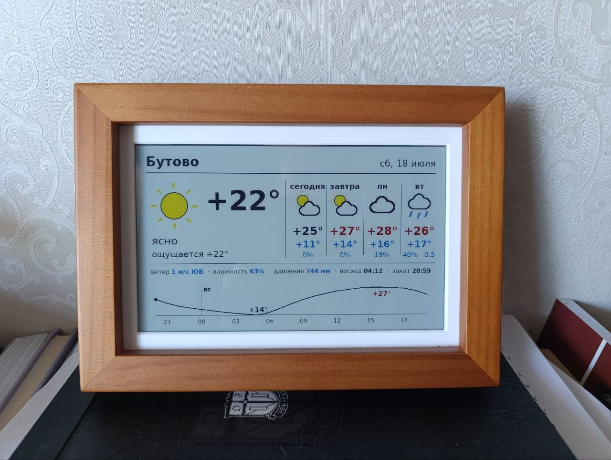
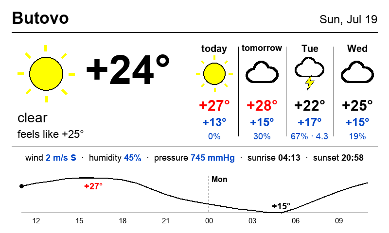

# Weatherka

[Русская версия](README.ru.md)

A DIY take on TRMNL: this service renders the weather forecast for
Butovo (Moscow) into an 800×480 PNG for a Spectra 6 (E6) e-ink photo
frame and serves it over HTTP. The frame polls `/api/frame.png`;
thanks to ETag/304 the display only redraws when the weather actually
changes — saving battery and E6 refresh cycles.

Weather data comes from [Open-Meteo](https://open-meteo.com/), no API key needed.



## What's on the card



- **Now** — icon (sun or moon depending on time of day), large
  temperature (red in heat ≥ +25°, blue in frost ≤ 0°), conditions,
  "feels like";
- **4-day forecast** — icon, max/min temperature, precipitation
  probability and amount;
- **Metrics** — wind, humidity, pressure (mmHg), sunrise/sunset;
- **24-hour chart** — hourly temperature with min/max labels, blue
  bars for precipitation probability, dashed line at midnight.

Icons are drawn with PIL primitives (outlined clouds, rain, snow,
thunderstorm, fog) — no external assets. Only pure Spectra 6 palette
colors are used, so the frame firmware maps them 1:1 without dithering.
Text lines auto-shrink to fit their width, so the layout survives
different font metrics (DejaVu in the container, Arial on a Mac during
development).

## The e-ink frame

The photo above is a 7.3" Waveshare Spectra 6 (E6) e-ink photo frame
([available on AliExpress](https://aliexpress.ru/item/1005010466222338.html))
running the open-source
[esp32-photoframe](https://github.com/aitjcize/esp32-photoframe) firmware.
Point its *Auto-Rotate URL* at `http://<weatherka-host>:8000/api/frame.png`
and it redraws itself as the forecast changes — the endpoint serves an
ETag, so the frame skips refresh cycles (and saves battery) when the
weather hasn't changed.

## Endpoints

- `GET /api/frame.png` — the card for the frame (ETag/304)
- `GET /api/weather` — data as JSON
- `GET /healthz` — status
- `GET /` — browser preview of the card

## Configuration (env)

| Variable | Default | |
|---|---|---|
| `LAT` / `LON` | `55.55` / `37.55` | coordinates (Butovo) |
| `PLACE` | `Бутово` | place name shown on the card |
| `WEATHER_TZ` | `Europe/Moscow` | timezone |
| `REFRESH_MINUTES` | `20` | forecast refresh interval |
| `FRAME_LANG` | `ru` | card language: `ru` or `en` (set `PLACE=Butovo` for `en`) |

Override them in `weatherka.service` (the `Environment=` line).

## Running with Docker

```sh
docker compose up -d --build
# UI: http://<host>:8000
```

Uncomment / edit the env vars in `docker-compose.yml` to set your
location, place name, timezone, refresh interval, or `FRAME_LANG`.
There's no state on disk — the forecast lives in memory and is
re-fetched from Open-Meteo on every container start, so no volume is
needed.

## Installing into an LXC container (Proxmox)

Create a container (on the pve host, Debian 12 template):

```sh
pct create 131 local:vztmpl/debian-12-standard_12.7-1_amd64.tar.zst \
  --hostname weatherka --memory 512 --cores 1 --rootfs local-lvm:4 \
  --net0 name=eth0,bridge=vmbr0,ip=dhcp --unprivileged 1 --start 1
```

Then, from a clone of this repository on the pve host:

```sh
./setup.sh 131      # first-time install: packages, venv, systemd
./deploy.sh 131     # subsequent code updates
```

The card will be served at `http://<container-ip>:8000/api/frame.png` —
point the frame at this URL as its image source.

## Running locally

```sh
python3 -m venv venv && venv/bin/pip install -r requirements.txt
venv/bin/uvicorn main:app --app-dir app --port 8000
```
