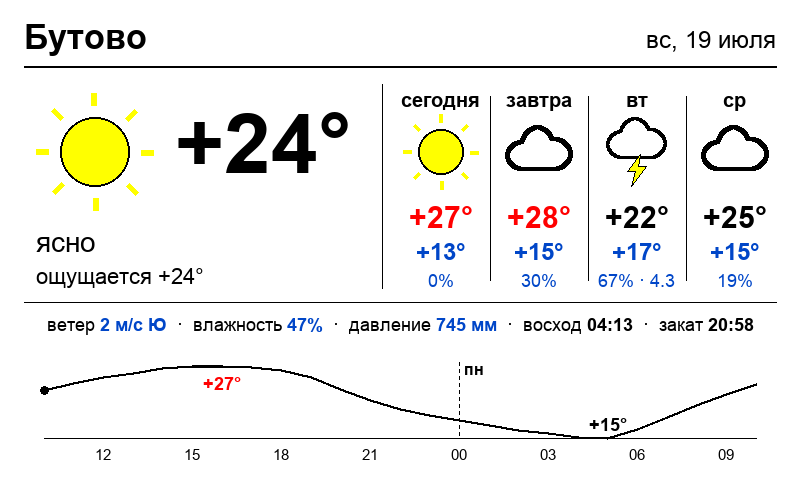

# Weatherka

[English version](README.md)

Самодельный аналог TRMNL: сервис рендерит прогноз погоды для Бутово (Москва)
в 800×480 PNG под e-ink рамку Spectra 6 (E6) и отдаёт его по URL.
Рамка опрашивает `/api/frame.png`; благодаря ETag/304 перерисовка
происходит только когда погода действительно изменилась — бережёт
батарею и циклы обновления E6.

Источник данных — [Open-Meteo](https://open-meteo.com/), без API-ключа.


## Что на кадре



- **Сейчас** — иконка (солнце/луна по времени суток), температура крупно
  (красная в жару ≥ +25°, синяя в мороз ≤ 0°), описание, «ощущается»;
- **Прогноз на 4 дня** — иконка, max/min, вероятность и сумма осадков;
- **Метрики** — ветер, влажность, давление (мм рт. ст.), восход/закат;
- **График на сутки** — почасовая температура с подписями экстремумов,
  синие столбики — вероятность осадков, пунктир — граница суток.

Иконки рисуются примитивами PIL (контурные облака, осадки, гроза, туман),
без внешних ассетов. Используются только чистые цвета палитры Spectra 6,
чтобы прошивка отображала их 1:1 без дизеринга. Размер шрифта строк
автоматически ужимается под ширину — макет не разъезжается на разных
шрифтах (DejaVu в контейнере, Arial на маке при разработке).

## E-ink рамка

На фото — 7.3" фоторамка Waveshare Spectra 6 (E6)
([продаётся на AliExpress](https://aliexpress.ru/item/1005010466222338.html))
с открытой прошивкой
[esp32-photoframe](https://github.com/aitjcize/esp32-photoframe).
В её настройках укажи *Auto-Rotate URL* =
`http://<хост-weatherka>:8000/api/frame.png` — рамка будет сама
перерисовываться при изменении прогноза. Эндпоинт отдаёт ETag, поэтому
когда погода не поменялась, рамка пропускает цикл обновления и бережёт
батарею.

## Эндпоинты

- `GET /api/frame.png` — кадр для рамки (ETag/304)
- `GET /api/weather` — данные в JSON
- `GET /healthz` — статус
- `GET /` — предпросмотр кадра в браузере

## Настройка (env)

| Переменная | По умолчанию | |
|---|---|---|
| `LAT` / `LON` | `55.55` / `37.55` | координаты (Бутово) |
| `PLACE` | `Бутово` | название на кадре |
| `WEATHER_TZ` | `Europe/Moscow` | часовой пояс |
| `REFRESH_MINUTES` | `20` | период обновления прогноза |
| `FRAME_LANG` | `ru` | язык кадра: `ru` или `en` (для `en` не забудь `PLACE=Butovo`) |

Переопределяются в `weatherka.service` (секция `Environment=`).

## Установка в LXC (Proxmox)

Создать контейнер (на pve, шаблон Debian 12):

```sh
pct create 131 local:vztmpl/debian-12-standard_12.7-1_amd64.tar.zst \
  --hostname weatherka --memory 512 --cores 1 --rootfs local-lvm:4 \
  --net0 name=eth0,bridge=vmbr0,ip=dhcp --unprivileged 1 --start 1
```

Затем из клона этого репозитория на pve:

```sh
./setup.sh 131      # первичная установка: пакеты, venv, systemd
./deploy.sh 131     # последующие обновления кода
```

Кадр будет доступен по `http://<ip-контейнера>:8000/api/frame.png` —
этот URL и указывается в настройках рамки как источник изображения.

## Локальный запуск

```sh
python3 -m venv venv && venv/bin/pip install -r requirements.txt
venv/bin/uvicorn main:app --app-dir app --port 8000
```
